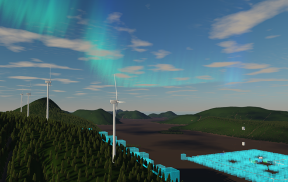

# Metasiberia

Metasiberia is a virtual world project created using the open-source Substrata software. 

**METASIBERIA°** is a virtual world project that offers a unique digital experience.
## Quick Access

- **🌐 Web Client**: [https://vr.metasiberia.com/webclient](https://vr.metasiberia.com/webclient)
- **🏠 Website**: [https://metasiberia.com/](https://metasiberia.com/)

## Community and Support

## Development

### Build System
Complete build instructions and automation scripts are available in the `Metasiberia_Build_System` directory.

### Contributing
We welcome contributions to the Metasiberia project. The codebase is based on the open-source Substrata platform.

## Credits

**Metasiberia** is based on and inspired by **Substrata**

- **Original Substrata**: [https://substrata.info/](https://substrata.info/)
- **Substrata Creator**: [https://x.com/NickChapmn](https://x.com/NickChapmn)
- **Metasiberia Author**: [https://x.com/denshipilovart](https://x.com/denshipilovart)

---

Metasiberia is based and inspired by Substrata