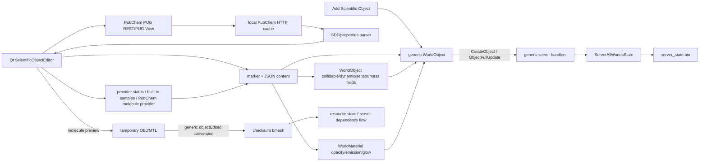
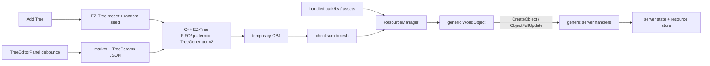

# Связи компонентов

Назначение: разделить логические data/control relations и физические build/deployment dependencies.

Проверено: 2026-07-14 по CMake, network handlers, serializers, current WIP PubChem integration и Procedural Tree resource flow.

## Логические зависимости

| Producer | Consumer/owner | Contract/data | Направление и правило |
| --- | --- | --- | --- |
| Qt/SDL Client | Realtime Server | protocol v62 framed messages | client proposes; server validates and becomes authoritative |
| Client | UDP handler | audio/latency-sensitive packets | separate transport, shared session/world semantics |
| Web Client | Realtime Server | WebSocket + тот же binary protocol | HTTP upgrade не создаёт второй gameplay API |
| Browser | HTTP/WebSocket Server | HTTP forms/assets/data/routes | route/form/response is contract |
| Server Website/Admin | Server state | direct in-process C++ access | auth/permissions/locks обязательны |
| Client editors | `WorldObject`/Parcel/WorldSettings/Bot/Gear | shared models + update messages | editor data зависит от generic/shared contract |
| Scientific Object Editor WIP | generic WorldObject | marker + JSON in `content`, status/provenance/provider/cache descriptors, materials/model URL, existing physics flags | сейчас интерпретируется Qt client; server opaque storage |
| Procedural Tree Editor WIP | generic WorldObject + ResourceManager | `metasiberia_tree_object_v1` JSON, generated `.bmesh`, checksum bark/leaf textures | Qt генерирует/редактирует; server хранит opaque JSON и обычные resources |
| Realtime/HTTP handlers | `ServerAllWorldsState` | world/user/resource/session records | общий authoritative owner |
| State serializer | `server_state.bin` | versioned binary records | disk compatibility boundary |
| Resource uploaders | ResourceManager/HTTP handler | checksum URL + bytes | content identity immutable |
| Screenshot bot | Server + GUI slave | connection type 504 + localhost render protocol | two-process helper flow |
| Map client/web | OSM tile endpoint/cache | namespaced PNG tiles + coordinates | MiniMap zoom отделён от world physical scale |
| Build/asset sources | runtime output | copy/preload/hash stages | source != generated != deployed |

## Physical build dependencies

| Physical target/module | Включает/зависит от | Следствие |
| --- | --- | --- |
| `gui_client` | `gui_client/`, selected `shared/`, `audio/`, `qt/`, external engine/libs | common change может затронуть Qt, SDL и Emscripten |
| `server` | `server/`, `webserver/`, selected `shared/`, `ethereum/`, external web/engine sources | web/admin/state нельзя собирать и deploy отдельно |
| `screenshot_bot` | bot + shared/network/engine sources | protocol/resource change имеет дополнительного consumer |
| `browser_process` | CEF-specific source | conditional target only |
| `libs` | dependency source aggregation | единственный явный CMake library target |
| Scientific Object Editor | Qt branch `gui_client`, MOC, `MainWindow`, `WorldObject` | не входит в SDL/Web special UI и не создаёт server target |
| Procedural Tree Editor | Qt branch `gui_client`, MOC, `MainWindow`, model loader/resource manager | native generator compiled only into `gui_client`; server/shared contract не расширен |
| Native Voxel Editor | shared `VoxelGroup`/mesher + Qt `VoxelEditorPanel`, `GUIClient`, Lucide runtime assets | protocol payload reused; metadata/tools/generators are client-side; SDL/Web special UI absent |
| Disabled bot/installer CMake | отдельные subproject definitions | не являются root build baseline |

## Physical deployment dependencies

| Deployable/runtime | Физические зависимости | Не следует предполагать |
| --- | --- | --- |
| Native Client | executable + copied runtime assets/dependencies | source compile не гарантирует correct staging |
| Web Client | JS/WASM/data + HTML shell + Server Website delivery | native build не публикует web output |
| `server` process | ELF, state/config/credentials, resource/media/web dirs | Windows `server.exe` не production binary |
| Server Website | disk-loaded public/fragments/webclient copies | server binary rebuild не обновляет assets |
| Public Website | external hosting/source unknown | `webserver_*` patch не меняет `metasiberia.com` автоматически |
| Screenshot pipeline | server + screenshot_bot + GUI slave + display/runtime assets | один bot service не заменяет renderer |
| Map services | server endpoint/cache + timers/scripts | render tiles и OSM tile delivery — разные линии |

## Scientific Object data flow (WIP)

Server/shared не распознают marker специально. Поэтому изменение JSON не требует нового message ID, но зависит от общего content limit, WorldObject serialization и generic permissions. PubChem provider, lazy section cache, Russian resolver, molecule viewport, atom/bond picking and measurements находятся на стороне Qt client. Native labels/legend/Rotation work as client information overlays; child `ObjectType_Text` lifecycle, SDL/Web parity, separate per-atom scene meshes and solver/trajectory adapters не подключены.

## Procedural Tree data flow (WIP)

Default create переводит local asset paths в checksum URLs до `CreateObject`; subsequent edits используют `GUIClient::objectEdited()` и общий dependency/GetFile flow. Ручная проверка server-confirm/reconnect/second-client остаётся обязательной.

## Contracts с максимальным радиусом

| Contract | Producers | Consumers | Обязательная проверка при изменении |
| --- | --- | --- | --- |
| `shared/Protocol.h` | client/server/bots | client/server/bots | all peers + compatibility |
| `WorldObject` network/disk serialization | editors/server/state | peers + persistence | client/server + old fixture |
| `WorldObject::content` 10 KB | editors/content serializers | network readers/state | bounded payload and rejection behavior |
| Resource checksum URL | uploader/resource manager | clients + HTTP | upload/download/fallback |
| Web route/form fields | browser/JS | C++ handlers | route + auth/permission/response |
| Runtime directory config | operator/config | WebDataStore/resources/media | local readback; production only with approval |
| Version headers | release process | UI/update/installer | synchronized headers + release policy |

## Change propagation

- Protocol/model -> client + server + bots + docs.
- Server handler/state -> persistence/locks + client behavior + operations if deployed.
- Website route -> handler + JS/forms + auth + disk asset/deploy stage.
- Scientific marker/schema -> editor parser/serializer + content bound + compatibility docs; server only if envelope changes.
- Tree marker/params -> native generator + model/material resource dependencies + generic content bound; server only if envelope changes.
- Resource path -> upload/download + copy/preload + desktop/web/XR consumers.

Связанные документы: [architecture.md](architecture.md), [data-map.md](data-map.md), [scientific-object-editor.md](scientific-object-editor.md).

Обновлять карту при новом producer/consumer, target/process, data transport или deployment boundary.
