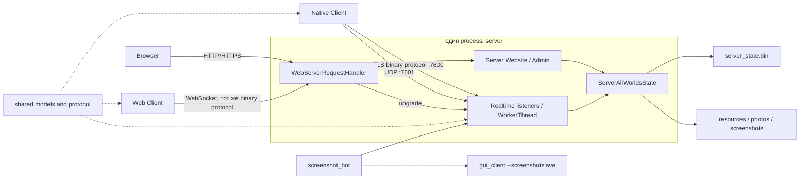

# Обзор системы Metasiberia

Назначение: главный обзор продукта, его runtime-границ и подтверждённых подсистем.

Проверено: 2026-07-10 по `master` (`2ef62fd6`) и текущему рабочему дереву. Production не опрашивался. Scientific Object Editor учитывается как официальный WIP, а не как готовая baseline-функция.

## Что представляет собой Metasiberia

Metasiberia — форк Substrata: постоянная многопользовательская 3D-среда с native- и web-клиентами, authoritative realtime server, пользовательскими мирами и объектами, ресурсами, server-side Luau, чатами, картой, ботами и встроенным web-интерфейсом.

Главные роли: игроки, создатели миров и объектов, администраторы server site, операторы runtime-сервисов и разработчики client/server/web/pipeline.

## Продукты и поверхности

| Поверхность | Реализация | Физическая граница | Статус |
| --- | --- | --- | --- |
| Native Client | `gui_client/`, Qt при `USE_SDL=OFF`, SDL альтернативно | executable `gui_client` | основная |
| Web Client | тот же C++ client через Emscripten + `webclient/webclient.html` | тот же target, browser artifacts | реализован; отдельной кодовой базы нет |
| Scientific Object Editor | `ScientificObjectEditor.*`, `ScientificObjectSettings.*`, интеграция в `MainWindow` | текущая UI-реализация основана на Qt внутри `gui_client` | официальный WIP |
| Realtime Server | `server/` | executable `server` | основная authoritative runtime |
| HTTP/WebSocket Server | `webserver/` + web core из `glare-core` | встроен в process `server` | основной |
| Server Website | handlers + `webserver_public_files/` + `webserver_fragments/` | origin `vr.metasiberia.com` по operational docs | основной source; live deployment не проверен |
| Admin Panel | `webserver/AdminHandlers.*`, routes `/admin*` | SSR-часть Server Website | одна панель, не отдельное приложение |
| Public Website | `metasiberia.com` | внешний hosting | source/deploy в repo не найден |
| Shared Engine/contracts | `shared/` + внешние `glare-core` и `winter` | sources агрегируются в consumers | критический общий слой |
| Pipeline | CMake, `scripts/`, assets, systemd, CI | набор build/deploy/runtime stages | mixed active/historical |

`rift.metasiberia.com` (Hyperfy/TheRift) документирован как связанный внешний runtime; его source отсутствует в этом репозитории.

## Логическая схема

Порты и origins отражают документированную схему, а не live health check.

## Основные архитектурные свойства

- `gui_client` — одна C++ codebase для Qt, SDL и Emscripten; `webclient/` содержит shell, а не второй gameplay client.
- `server` одновременно владеет realtime protocol, authoritative state, persistence и встроенными HTTP/HTTPS/WebSocket listeners.
- `webserver/` — source module target `server`, не отдельный service.
- `shared/` определяет wire/model contracts; часть тех же типов сериализуется в network и disk state.
- Persistence — custom binary record database `server_state.bin`; SQL/ORM boundary не обнаружен.
- Resources content-addressed: metadata связано со state, bytes лежат в runtime resource directories.
- Source assets, generated output и deployed runtime copies являются разными стадиями.

## Scientific Objects: реальная WIP-граница

Scientific Object сейчас является обычным `WorldObject::ObjectType_Generic`. Его настройки сохраняются в `WorldObject::content` как маркер `metasiberia_scientific_object_v1` и JSON. Создание/изменение используют существующие `CreateObject` и `ObjectFullUpdate`; отдельного server message, shared type или scientific database нет.

Реализованы Qt editor, metadata/data/visualisation controls, локальные mock-шаблоны, molecule table parsing, временная OBJ/MTL-генерация и существующий generic conversion в content-addressed `.bmesh` через `GUIClient::objectEdited()`. Не реализованы как подтверждённый end-to-end flow: внешние database adapters, AI network calls, исполнение generated code, универсальный file import, simulation и отдельная scientific persistence. Общий `WorldObject::MAX_CONTENT_SIZE` равен 10 000 байт и уже ограничивает заявленную табличную модель.

Подробности: [data-map.md](data-map.md#scientific-object-wip) и [current-state.md](current-state.md#официальный-wip-scientific-object-editor).

## Contracts и данные

- Wire protocol: `shared/Protocol.h`, version `62`; framing — `shared/MessageUtils.h`.
- Domain models: `WorldObject`, `WorldMaterial`, `WorldSettings`, `Parcel`, `Resource`, `Avatar`, `GearItem` и server-owned records.
- Authoritative runtime state: `ServerAllWorldsState` + `server_state.bin` и внешние resource/media directories.
- Client-local state: QSettings, cache, logs, chat history и traces вне Git; часть данных чувствительна.
- Scientific settings пока вложены в строковое поле общего объекта и не образуют новый shared schema type.

## Точки входа

| Назначение | Точка входа |
| --- | --- |
| Qt client | `gui_client/MainWindow.cpp::main()` |
| SDL/Emscripten client | `gui_client/SDLClient.cpp::main()` |
| Scientific Object UI | `MainWindow::on_actionAddScientificObject_triggered`, `ScientificObjectEditor` |
| Server | `server/Server.cpp::main()` |
| HTTP/WS routing | `webserver/WebServerRequestHandler.cpp` |
| Screenshot bot | `screenshot_bot/ScreenshotBot.cpp::main()` |
| Site capture | `tools/site_capture/capture.mjs` |

## Не подтверждено

- Live production service/DNS/state/deployed assets на 2026-07-10.
- Source/deploy внешнего Public Website, TheRift и avatar service.
- Самостоятельная собираемость root-disabled auxiliary targets.
- End-to-end готовность Scientific Object Editor и безопасное хранение его AI credentials.

## Навигация

- Что и где находится: [project-map.md](project-map.md).
- Как компоненты устроены: [architecture.md](architecture.md).
- Producers/consumers: [component-relations.md](component-relations.md).
- Реализовано/WIP/планы: [current-state.md](current-state.md).
- Все документы: [documentation-index.md](documentation-index.md).

Обновлять обзор при появлении нового deployable, отдельного client/backend, нового shared contract/data store или изменении статуса Scientific Object WIP.
